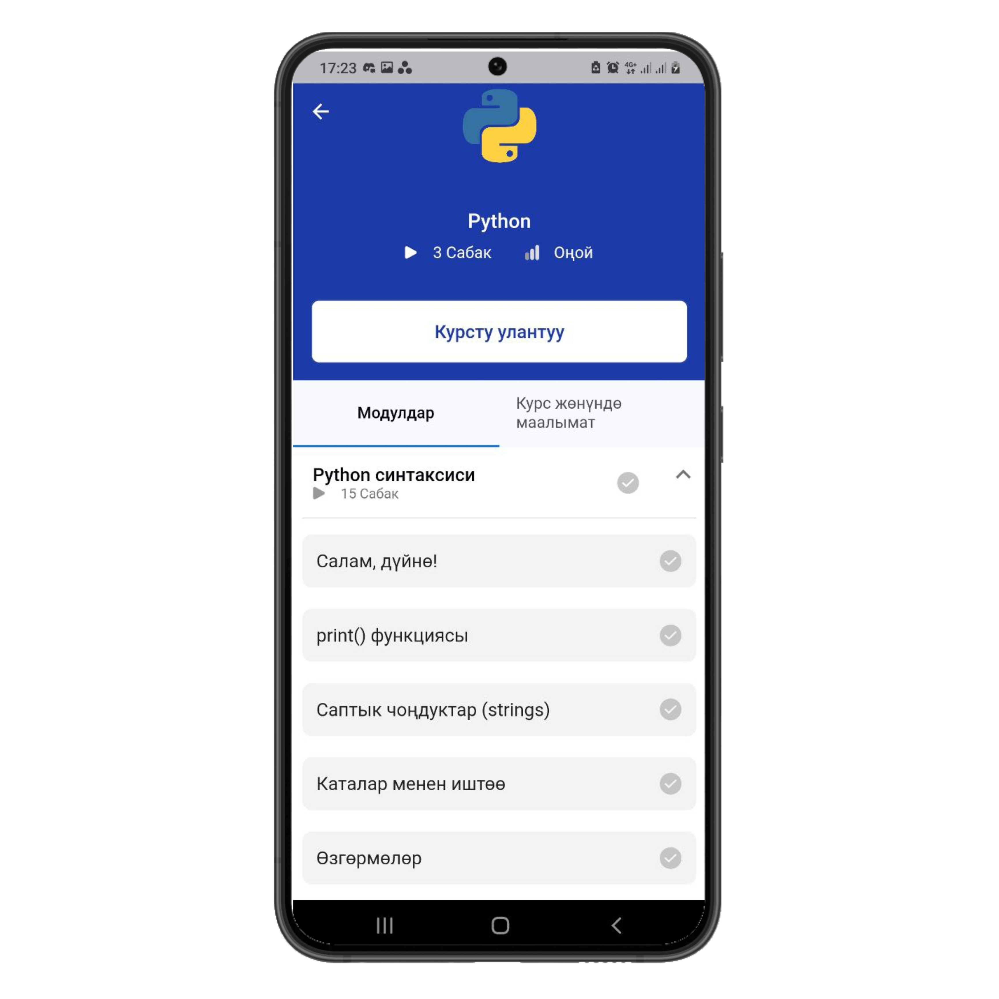
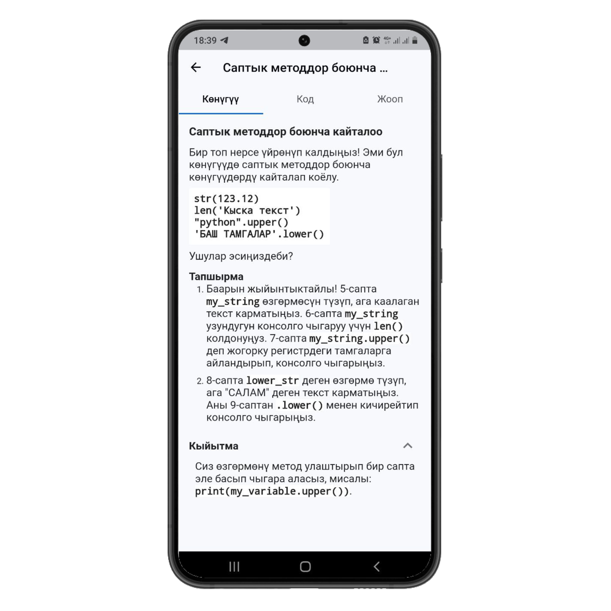
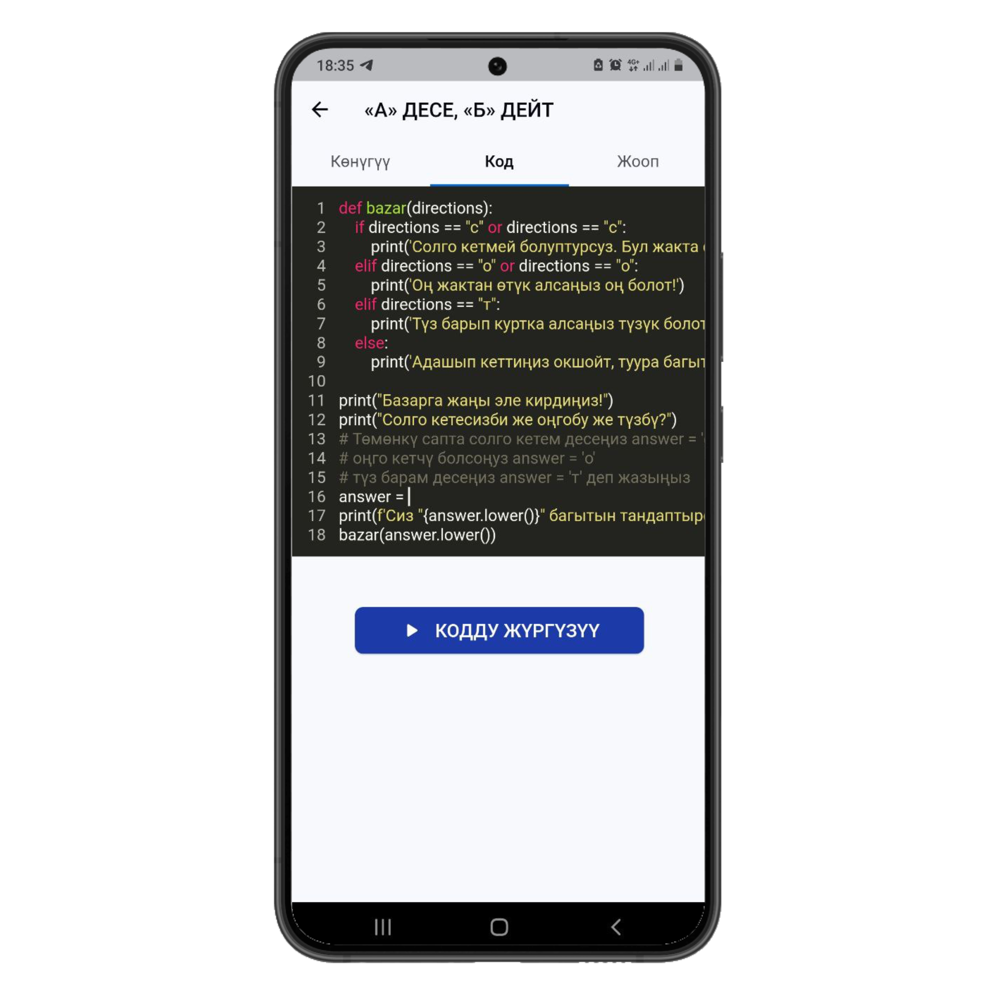
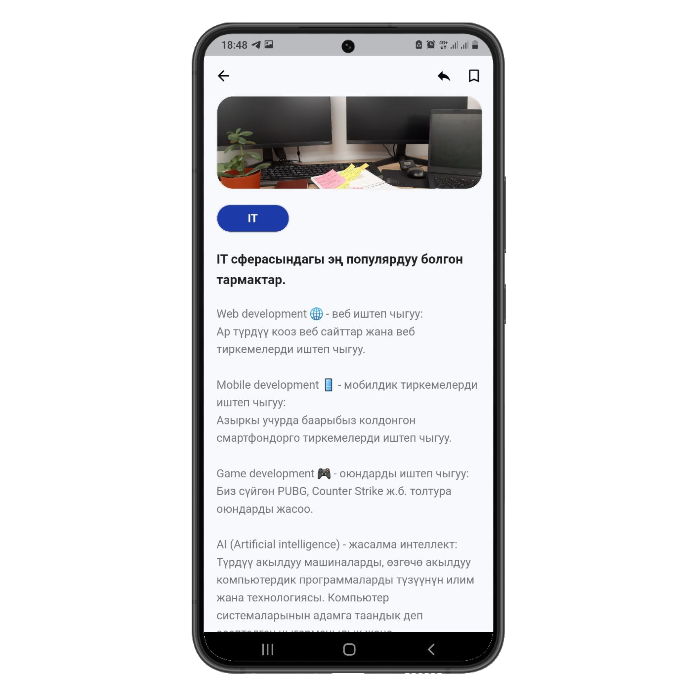

# bilimapp Flutter Project

This is the bilimapp Flutter project, which is a mobile application that provides programming exercises and tutorials to help beginners learn programming in a fun and interactive way.

## Screenshots








## Requirements

- Flutter SDK
- Android Studio or Xcode for emulator/simulator (optional)
- Visual Studio Code or any other preferred IDE

## Getting Started

To get started with the project, follow these steps:

1. Clone the repository using the command below:

```
git clone https://github.com/kuba-asanov/bilimapp_flutter.git
```

2. Navigate into the project directory:

```
cd bilimapp_flutter
```

3. Install the required dependencies:

```
flutter pub get
```

4. Run the app:

```
flutter run
```

## Features

- User authentication
- Interactive coding exercises
- Exercises progress tracking
- User profile management
- Write and run code

### Used libraries:

- flutter_bloc
- freezed
- get_it
- injectable
- auto_route
- flutter_screenutil
- retrofit
- dio
- hive
- code_text_field
- flutter_markdown
- flutter_smart_dialog
- cached_network_image
- graphql_flutter

### To build run this command:

```
sh scripts/build.sh
```

### To generate localization run this command:

```
sh scripts/lang.sh
```

To navigate to new page use:

```
Navigation.router.push(MyRoute());
```

## Contributing

We welcome contributions from the community! If you would like to contribute to the project, please fork the repository and submit a pull request.

## License

This project is licensed under the MIT License - see the [LICENSE](LICENSE) file for details.
